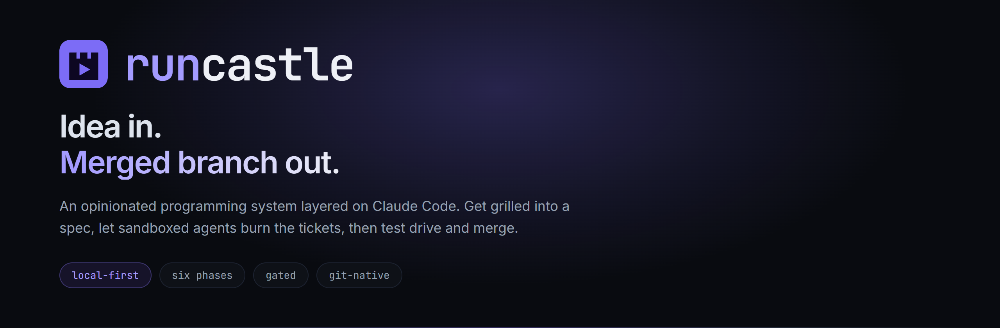
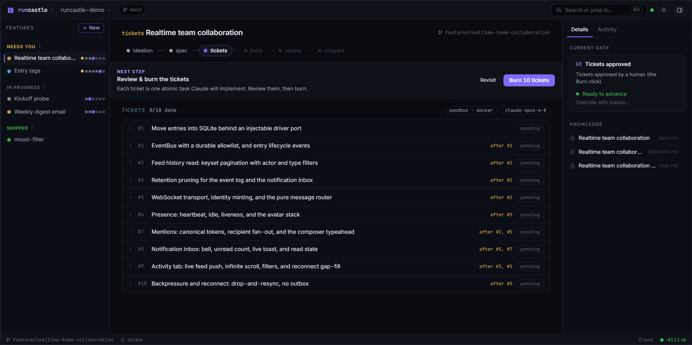
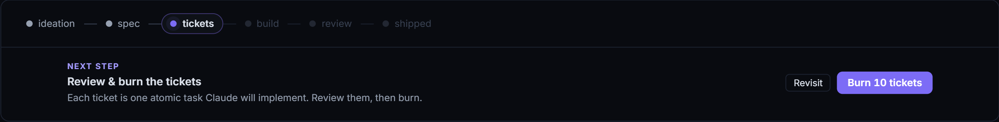
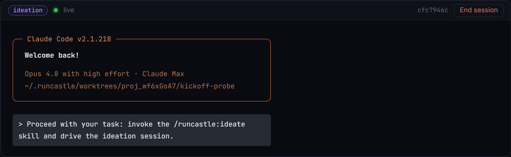
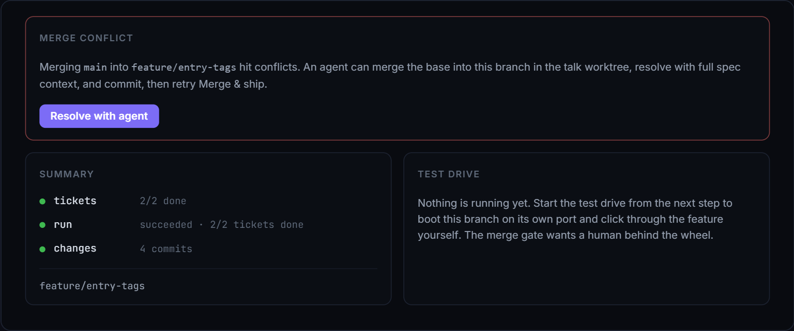

<p align="center">
  
</p>

<p align="center">
  <a href="https://www.npmjs.com/package/runcastle"></a>
  <a href="LICENSE"></a>
  
  <a href="https://claude.com/claude-code"></a>
</p>

<p align="center">
  <b>runcastle is an opinionated programming system layered on Claude Code:<br />the IDE to Claude Code's text editor.</b>
</p>

<p align="center">
  <a href="#install">Install</a>
  &nbsp;&nbsp;·&nbsp;&nbsp;
  <a href="#the-loop">The loop</a>
  &nbsp;&nbsp;·&nbsp;&nbsp;
  <a href="#the-afk-sandbox">Sandbox</a>
  &nbsp;&nbsp;·&nbsp;&nbsp;
  <a href="#contributing">Contributing</a>
  &nbsp;&nbsp;·&nbsp;&nbsp;
  <a href="#troubleshooting">Troubleshooting</a>
</p>

---

Every feature you build gets a persistent session that walks a pipeline:
**ideation, spec, tickets, build, review, shipped**. You get grilled on an idea
until a spec and a set of tickets fall out. Sandboxed AFK agents burn those
tickets on a branch. You test drive the result and merge. Human in the loop at
only the two ends.

It runs entirely on your machine: a Bun server plus a browser UI at
`http://localhost:4512`. There is no runcastle account and no hosted backend.

<p align="center">
  
</p>

> New here? [`CONTEXT.md`](CONTEXT.md) has the vision and the locked decisions.

---

## Install

```sh
bun add -g runcastle       # install
runcastle doctor           # check prerequisites
runcastle                  # boot the server and open http://localhost:4512
```

`runcastle --version` prints the installed version. When a newer release is
published an in-app banner names the exact `bun add -g runcastle@latest`
command. runcastle never installs anything for you.

### Prerequisites

runcastle drives real tools on your machine, so a few things must already be
present. Run `runcastle doctor` at any time: it probes each one and prints a
copy-pasteable fix for whatever is missing. (`runcastle doctor --gate` is the
stricter pre-boot gate that stops only on the must-haves.)

| Requirement | Why runcastle needs it |
|---|---|
| **[Bun](https://bun.sh) 1.3.14+** | The runtime. `curl -fsSL https://bun.sh/install \| bash`, or `irm bun.sh/install.ps1 \| iex` on Windows. |
| **[Claude Code](https://claude.com/claude-code)** | The engine runcastle drives. Install, then log in with `claude`. **Requires a paid Claude plan** (Pro, Max, Team, Enterprise, or Console); the free Claude.ai plan has no Claude Code access. |
| **[Git](https://git-scm.com)** | runcastle branches, worktrees, commits, and merges on your behalf. It also needs a commit identity: the first-run wizard collects one, or set it yourself. |
| **[Node.js](https://nodejs.org) 22+** | **Windows only.** The embedded terminal uses a `node`-hosted PTY sidecar, because node-pty's ConPTY pipe misbehaves under Bun. Windows without `node` on PATH gets terminals that instantly exit. Not needed on macOS. On Linux it is only needed to build node-pty from source if the vendored prebuild does not apply. |

Platform baselines: macOS 13+, Windows 10 1809+ (64-bit), or a modern Linux.

**Only for AFK burns.** Skip these if you just want interactive sessions:

- A **container runtime**, Docker or Podman. See
  [The AFK sandbox](#the-afk-sandbox).
- An **AFK auth token.** Run `claude setup-token` on this machine and put
  `CLAUDE_CODE_OAUTH_TOKEN=…` in `~/.runcastle/.env`. Each user authenticates
  against their own subscription; nothing routes through runcastle.

### First run

1. Run `runcastle` and open `http://localhost:4512`.
2. On a fresh machine a short **first-run wizard** appears:
   - **Git identity.** The one hard step. runcastle commits docs and merges for
     you, so it writes your name and email to `git config --global`. Skipped
     automatically if you already have one.
   - **Enable AFK burns.** Optional. Set up the sandbox and auth token now, or
     skip and do it later.
   - **Open your first project.** Point runcastle at a git repo.
3. Inside a project, drive the loop below.

---

## The loop

<p align="center">
  
</p>

The app always names the one next step, and it only stops you twice: once to
approve the tickets, once to merge.

| Phase | What happens |
|---|---|
| **ideation** | A real Claude Code terminal opens with the feature brief, phase rules, and runcastle's skill pack pre-injected, and argues with you until the idea is concrete. |
| **spec** | The decisions get written down as a spec, committed into your repo under `docs/features/<slug>/`. |
| **tickets** | The spec is split into atomic tickets with a dependency order. **You review and click burn.** |
| **build** | AFK agents burn each ticket inside a container, committing to the feature branch. |
| **review** | Checks land, then you test drive the branch on its own port. **You click merge.** |
| **shipped** | The branch is merged. The spec, decisions, and run history stay queryable. |

Gates sit between the phases. They block by default, and every one takes an
override with a one-line reason that is recorded in the feature's history.
Seatbelt, not cage.

### What it looks like

| Live Claude Code session, bound to a phase | Review, with agent-assisted conflict resolution |
|---|---|
|  |  |

---

## The AFK sandbox

AFK ticket burns run inside a container via
[sandcastle](https://github.com/mattpocock/sandcastle) (`@ai-hero/sandcastle`).
Docker is the default and smoothest path; Podman is a fully supported free
alternative. After installing a runtime, build the image once with
`sandcastle docker build-image`, because nothing builds it for you.
`runcastle doctor` reports when the image is missing.

<details>
<summary><b>Docker setup, per platform</b></summary>

<br />

| Platform | What you need |
|---|---|
| **Linux** | **Docker Engine is enough, Desktop is not required.** After installing, run `sudo usermod -aG docker $USER` and re-login, or every call needs `sudo`. |
| **Windows** | **Docker Desktop.** Floor: **Windows 10 22H2** (build 19045) or Windows 11, 64-bit, with **WSL2** (the default backend) or Hyper-V, virtualization enabled in BIOS/UEFI, 8 GB RAM. |
| **macOS** | **Docker Desktop**, current or one of the two previous major macOS releases. |

Start the daemon (Docker Desktop, or `sudo systemctl start docker` on Linux)
before a burn. `runcastle doctor` tells you if the CLI is installed but the
daemon is not responding.

</details>

> [!IMPORTANT]
> **Docker Desktop licensing, if you are using this at work.**
> Docker Desktop is free for personal use, education, non-commercial open
> source, and small businesses, but a **paid subscription is required** for
> larger organizations and government entities. This binds *the organization
> running Docker Desktop*, not the tool recommending it: runcastle being open
> source grants you nothing here. The exact thresholds change, so check
> [docker.com/pricing](https://www.docker.com/pricing/). If you are not
> covered, use **Podman**, which has no such restriction.

<details>
<summary><b>Podman setup (free alternative)</b></summary>

<br />

[Podman](https://podman.io) is Apache-2.0 with no employee or revenue threshold
and no commercial-use restriction. The CLI alone is enough; Podman Desktop is
optional. sandcastle drives whichever runtime is on your PATH.

- **Linux:** `dnf install podman` / `apt install podman` / `pacman -S podman`.
  Native and rootless, no VM.
- **Windows:** `winget install -e --id RedHat.Podman`, then
  `podman machine init && podman machine start`. Install WSL first with
  `wsl --install` if you have not.
- **macOS:** the official installer, then
  `podman machine init && podman machine start`. Podman's docs discourage the
  Homebrew build.

</details>

---

## How it works

runcastle is the orchestration, memory, and observation layer. It never rebuilds
the chat UX.

- **Interactive work** runs in **real Claude Code terminals** that runcastle
  launches with context pre-injected: a generated feature brief via
  `--append-system-prompt-file`, per-session hooks via inline `--settings`,
  phase-scoped skill packs via `--plugin-dir`, and runcastle's own MCP server
  via `--mcp-config`. Terminals are server-owned PTYs streamed to an in-app
  xterm view.
- **AFK work** runs headless through sandcastle, in a Docker or Podman
  container, committing back to the feature branch.
- **Knowledge lives in your repo** at `docs/features/<slug>/`: spec, decisions,
  research, notes. Versioned and agent-readable, and it outlives the tool.
- **Machinery lives in the app's SQLite** at `~/.runcastle/`: phase state,
  session links, workflow runs, transcript index.
- **Git topology:** one branch per feature; interactive sessions get instant
  docs-only worktrees so several features can be grilled in parallel; the main
  checkout stays reserved for you, with a guarded test-drive switch that stashes
  and restores your work.

### Packages

Bun workspaces, TypeScript strict, ESM only.

| Package | Name | Role |
|---|---|---|
| `packages/core` | `@runcastle/core` | IO-free contracts: zod schemas, drizzle schema, pipeline and gates, paths, workflow types, config. |
| `packages/server` | `@runcastle/server` | Hono + tRPC + services + launcher + MCP + workflows. Runs TS directly with Bun, no build step. |
| `packages/skills` | `@runcastle/skills` | Vendored and forked Claude Code skill packs, plus the ticket-burner prompt template. |
| `packages/design-system` | `@runcastle/design-system` | Near-black IDE-grammar UI primitives. |
| `apps/web` | `@runcastle/web` | Vite + React + tRPC client + TanStack Query. |
| `site/` | | The static landing page. No build step. |

---

## Contributing

The steps above install the published command. To work on runcastle itself:

```sh
git clone https://github.com/MuathZahir/runcastle
cd runcastle
bun install            # install the workspace (never npm/pnpm/yarn)
bun run dev            # server (4512) + web dev server (4513)
```

| Command | What it does |
|---|---|
| `bun run typecheck` | `tsc --noEmit` across the typed packages. |
| `bun run test` | The Vitest suite: core contracts plus server services, git, hooks, MCP, and burner. |
| `bun run scripts/smoke.ts` | A scripted end-to-end run against a throwaway repo and a real host `claude`. |

Read [`CLAUDE.md`](CLAUDE.md) for conventions and [`docs/SPEC.md`](docs/SPEC.md)
for the contracts before implementing anything.

---

## Troubleshooting

Start with `runcastle doctor`. It names the exact failing prerequisite and the
fix. Beyond that:

<details>
<summary><b><code>bun</code> or <code>runcastle</code> not found on Windows after install</b></summary>

<br />

Add `%USERPROFILE%\.bun\bin` to your PATH.

</details>

<details>
<summary><b>Bun install fails on a fresh Linux box</b></summary>

<br />

The installer needs `unzip` (`sudo apt install unzip`). An `Illegal Instruction`
crash means your CPU lacks AVX2; use Bun's `x64-baseline` build.

</details>

<details>
<summary><b>The embedded terminal will not start, or instantly exits</b></summary>

<br />

node-pty's native binary (`pty.node`) is missing. runcastle's postinstall bridge
copies a vendored Linux prebuild into place, and doctor plus first-run assert
the binary is actually on disk. A repeat `bun install` exits `0` even when it is
still missing, so the disk check is what catches it. Re-run `bun install`. If it
still fails you are either without a C++ toolchain, or on musl (below).

On Windows, this is almost always a missing system `node`. See
[Prerequisites](#prerequisites).

</details>

<details>
<summary><b>musl / Alpine Linux</b></summary>

<br />

The vendored prebuild is glibc-only and cannot load under musl, so node-pty must
be built from source: `apk add build-base python3`, then `bun install`.

</details>

<details>
<summary><b>Podman on Windows cannot mount your files</b></summary>

<br />

A Podman machine is its own WSL distro and cannot see paths inside *your* WSL
distro. Windows drive paths (mounted at `/mnt/c`) do work. runcastle's data dir
is `~/.runcastle/`, so the common Windows case is fine, but running runcastle
*inside* WSL against a Podman machine will fail its bind mounts.

</details>

<details>
<summary><b>AFK burns fail with an auth error</b></summary>

<br />

Make sure `CLAUDE_CODE_OAUTH_TOKEN` is in `~/.runcastle/.env`, generated by
`claude setup-token`. Doctor checks for it.

</details>

---

## License

[MIT](LICENSE) © Muath Zahir

Built with [Claude Code](https://claude.com/claude-code). Methodology forked and
adapted from [Matt Pocock](https://github.com/mattpocock)'s skills; AFK engine
by [sandcastle](https://github.com/mattpocock/sandcastle).
