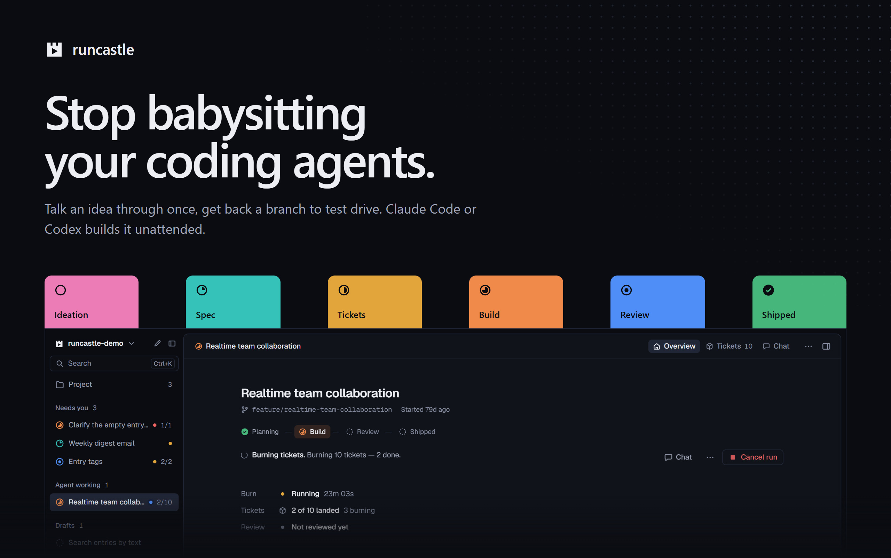
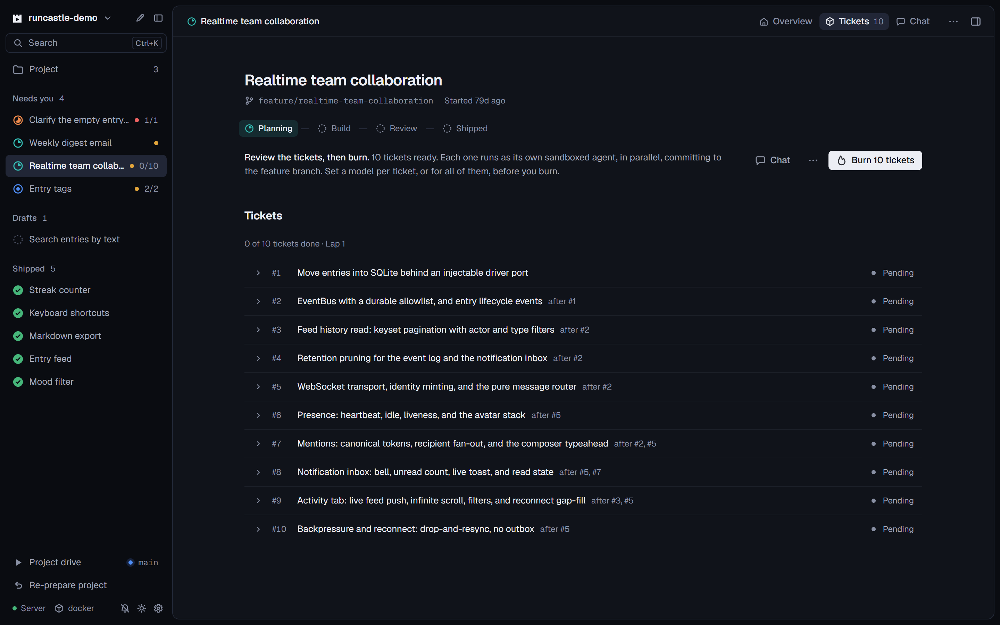
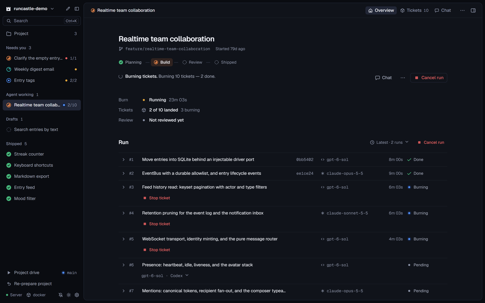
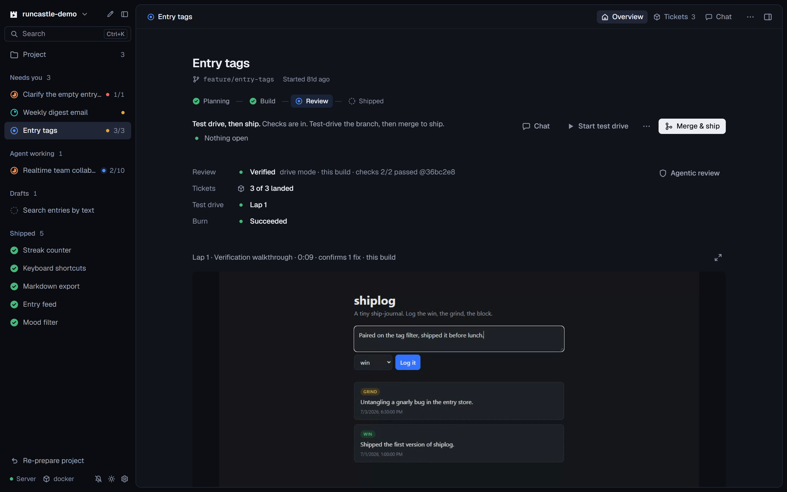
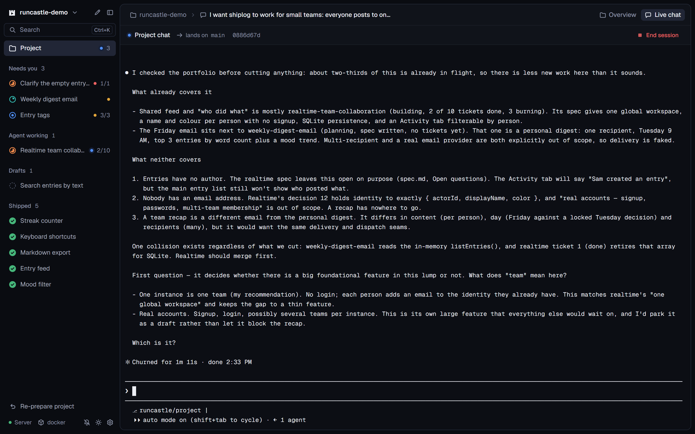
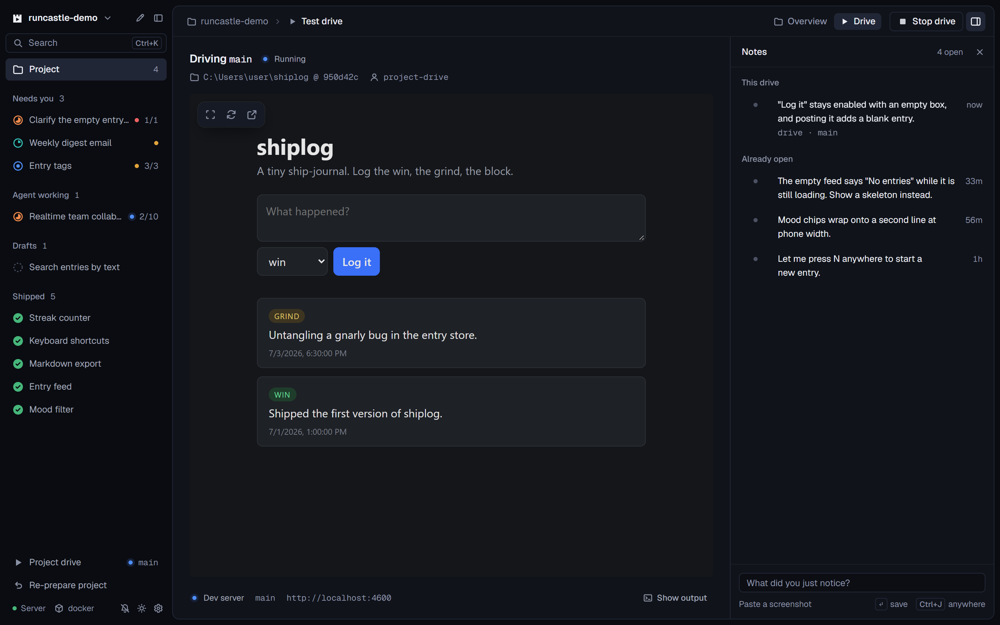
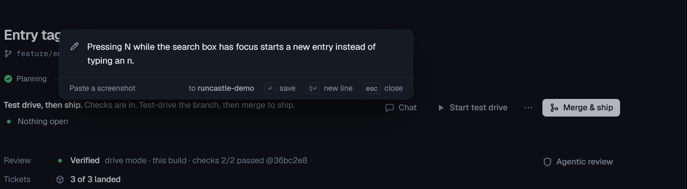
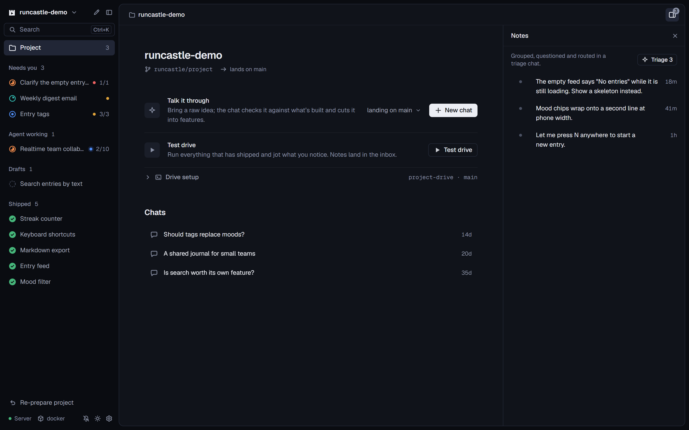
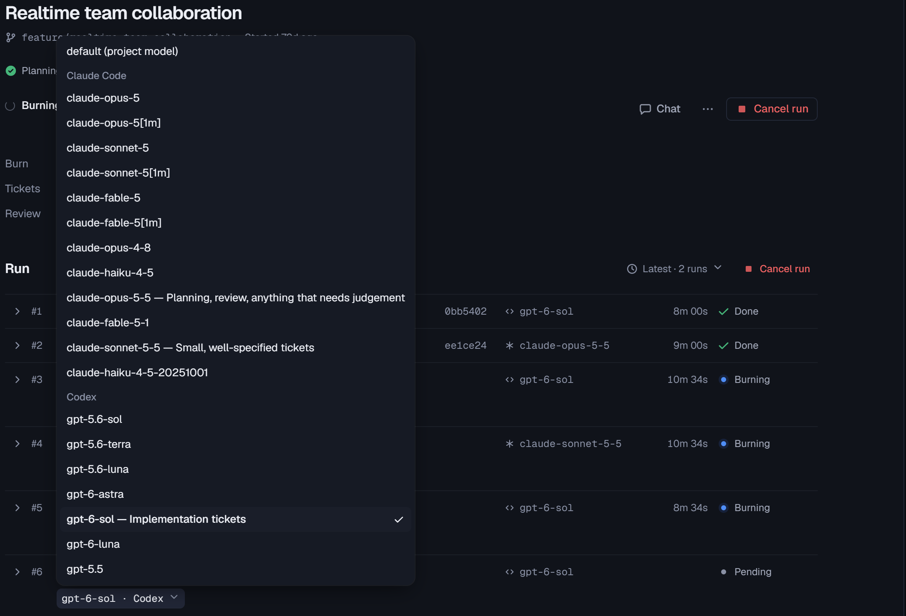

<p align="center">
  
</p>

<p align="center">
  <a href="https://www.npmjs.com/package/runcastle"></a>
  <a href="LICENSE"></a>
  
  
</p>

<p align="center">
  <b>Idea in, merged branch out. On your machine, in your repo.</b>
</p>

<p align="center">
  <a href="https://runcastle.dev">Website</a>
  &nbsp;&nbsp;·&nbsp;&nbsp;
  <a href="#install">Install</a>
  &nbsp;&nbsp;·&nbsp;&nbsp;
  <a href="#the-loop">The loop</a>
  &nbsp;&nbsp;·&nbsp;&nbsp;
  <a href="#claude-code-or-codex">Claude Code or Codex</a>
  &nbsp;&nbsp;·&nbsp;&nbsp;
  <a href="#contributing">Contributing</a>
  &nbsp;&nbsp;·&nbsp;&nbsp;
  <a href="#troubleshooting">Troubleshooting</a>
</p>

---

Every feature you build gets its own conversation, its own branch and its own
memory, and walks a pipeline: **ideation, spec, tickets, build, review,
shipped**. You get grilled on an idea until a spec and a set of tickets fall
out. Sandboxed agents burn those tickets on the feature's branch while you are
elsewhere. You test drive the result and merge.

You make two calls per feature: approve the tickets, approve the merge.
Everything between them runs without you, so several features move at once and
the sidebar only flags the ones actually waiting on you.

It runs entirely on your machine: a Bun server plus a browser UI at
`http://localhost:4512`. There is no runcastle account and no hosted backend.

<p align="center">
  
</p>

> New here? [runcastle.dev](https://runcastle.dev) has the sixty-second film,
> and [`CONTEXT.md`](CONTEXT.md) has the vision and the locked decisions.

---

## Install

```sh
bun add -g runcastle       # install
runcastle doctor           # check prerequisites
runcastle                  # boot the server and open http://localhost:4512
```

`runcastle --version` prints the installed version. When a newer release is
published an in-app banner names the exact `bun add -g runcastle@latest`
command. runcastle never installs anything for you.

### Prerequisites

runcastle drives real tools on your machine, so a few things must already be
present. Run `runcastle doctor` at any time: it probes each one and prints a
copy-pasteable fix for whatever is missing. (`runcastle doctor --gate` is the
stricter pre-boot gate that stops only on the must-haves.)

| Requirement | Why runcastle needs it |
|---|---|
| **[Bun](https://bun.sh) 1.3.14+** | The runtime. `curl -fsSL https://bun.sh/install \| bash`, or `irm bun.sh/install.ps1 \| iex` on Windows. |
| **A coding agent: [Claude Code](https://claude.com/claude-code), [Codex](https://developers.openai.com/codex), or both** | The engines runcastle drives. You need at least one, signed in. **Claude Code** needs a paid Claude plan (Pro, Max, Team, Enterprise, or Console); install it, then log in with `claude`. **Codex** installs with `npm install -g @openai/codex` (or `brew install codex`); log in with `codex login`, on a ChatGPT plan or an API key. |
| **[Git](https://git-scm.com)** | runcastle branches, worktrees, commits, and merges on your behalf. It also needs a commit identity: the first-run wizard collects one, or set it yourself. |
| **[Node.js](https://nodejs.org) 22+** | **Every platform.** The embedded terminal runs in a `node`-hosted PTY sidecar whenever runcastle runs under Bun, because node-pty does not work in-process under Bun (its Windows ConPTY input pipe breaks, and on Linux the terminal hangs up after its first output). Without `node` on PATH, terminals exit instantly. |

Platform baselines: macOS 13+, Windows 10 1809+ (64-bit), or a modern Linux.

**Only for AFK burns.** Skip these if you just want interactive sessions:

- A **container runtime**, Docker or Podman. See
  [The AFK sandbox](#the-afk-sandbox).
- **Agent credentials**, one step per runtime you burn on. For **Claude Code**,
  run `claude setup-token` on this machine and put `CLAUDE_CODE_OAUTH_TOKEN=…` in
  `~/.runcastle/.env`. For **Codex**, run `codex login` — that is the whole of it;
  a burn borrows the credentials the login wrote. Either way you authenticate
  against your own subscription; nothing routes through runcastle. (A
  `CODEX_API_KEY` you put in `~/.runcastle/.env` by hand still wins over the
  borrowed login, if you would rather bill an OpenAI API key.)

### First run

1. Run `runcastle` and open `http://localhost:4512`.
2. On a fresh machine a short **first-run wizard** appears:
   - **Git identity.** The one hard step. runcastle commits docs and merges for
     you, so it writes your name and email to `git config --global`. Skipped
     automatically if you already have one.
   - **Coding agents.** Claude Code and Codex side by side: which are
     installed, which are signed in, and a button that runs the login for the
     ones that are not. One is enough.
   - **Enable AFK burns.** Optional. Set up the sandbox and credentials now, or
     skip and do it later.
   - **Open your first project.** Point runcastle at a git repo.
3. **Prepare the project.** One conversation, once, that records how your repo
   installs, verifies, and runs, so no agent has to guess.
4. Start something: **New feature** when you know what you want, or
   [the project session](#the-project-session) when you have a complaint
   rather than a plan.

---

## The loop

The app always names the one next step, and it only stops you twice: once to
approve the tickets, once to merge.

| Phase | What happens |
|---|---|
| **ideation** | A real agent terminal opens with the feature brief, phase rules, and runcastle's skill pack pre-injected, and argues with you until the idea is concrete. |
| **spec** | The decisions get written down as a spec, committed into your repo under `docs/features/<slug>/`. |
| **tickets** | The spec is split into atomic tickets with a dependency order, each with a model picked for it. **You review and click burn.** |
| **build** | AFK agents burn each ticket inside a container, in parallel, committing to the feature branch. You can close the tab. |
| **review** | A review agent drives the running app, records a walkthrough, runs your checks, and fixes what it finds. Then you test drive the branch. **You click merge.** |
| **shipped** | The branch is merged. The spec, decisions, and run history stay queryable. |

Gates sit between the phases. They block by default, and every one takes an
override with a one-line reason that is recorded in the feature's history.
Seatbelt, not cage.

### Build: agents burn tickets in parallel

Every unblocked ticket starts at once, each in its own sandboxed lane, each on
its own model. Lanes land their commits on the feature branch, and a ticket that
fails says why, with retry, retry on another model, and waive one click away.

<p align="center">
  
</p>

### Review: the agent drives it first

Before you look, a review agent runs the app, clicks through the feature, and
records it. Defects it finds become fix tickets and burn in the same lap; a
second pass verifies the fixes. You get a verdict, the checks, and the
walkthrough, and the one next step is **Merge & ship**.

<p align="center">
  
</p>

---

## Beyond one feature

### The project session

Every feature has its own conversation; the project session is the one that
does not. It is a single chat per project for the part that happens *before* a
feature exists. Bring it a complaint, a screenshot, a paragraph from a
customer. It checks the idea against what is already built and in flight,
grills you on what is left, and cuts the rest into features, drafts, or a quick
change.

<p align="center">
  
</p>

It runs in a worktree runcastle owns, on `runcastle/project`, never in your
checkout. It is also where `CONTEXT.md`, the project's standing decisions, gets
written.

**Drafts** are features you parked: a title, a one-liner and an optional brief,
with no branch cut and nothing committed. You park them from the New feature
form, and feature conversations park the scope they find that does not belong
to them. **Start** cuts the branch and opens ideation.

### Test drive, and jot what you notice

**Test drive** runs everything that has shipped, in runcastle, with the app on
the left and your notes on the right. A note can take a pasted screenshot, and
it remembers the branch and commit it was written against.

<p align="center">
  
</p>

You do not have to be driving to take one. **Ctrl+J** (**⌘J** on a Mac) opens
a note anywhere in the app, even with focus in a terminal:

<p align="center">
  
</p>

Notes collect in the project's inbox. **Triage** opens a project chat that
clusters them into themes, grills you one theme at a time, and routes each one:
a new feature, a batch of quick changes, another lap on an existing feature, or
nothing.

<p align="center">
  
</p>

---

## Claude Code or Codex

runcastle drives either agent, and you can mix them. The runtime is a property
of the *model*, so you choose models, not vendors:

- **Per step.** A default model, then one each for planning chats, the project
  session, implementation, and review. Plan with Claude and burn on Codex, or
  the other way round.
- **Per ticket.** Give a model a use-case note in Settings and the tickets agent
  may assign it to the tickets that fit. Reassign any queued ticket yourself,
  even mid-burn.
- **Per project.** A project can pin its own model and override the machine
  default.

<p align="center">
  
</p>

Both runtimes get the same treatment: the same phase rules and skill pack, the
same lifecycle hooks, the same runcastle MCP server, the same sandbox. The model
roster refreshes itself from each CLI, so a new model shows up without a
runcastle release.

---

## The AFK sandbox

AFK ticket burns run inside a container via
[sandcastle](https://github.com/mattpocock/sandcastle) (`@ai-hero/sandcastle`).
Docker is the default and smoothest path; Podman is a fully supported free
alternative. After installing a runtime, build the image once with
`sandcastle docker build-image`, because nothing builds it for you.
`runcastle doctor` reports when the image is missing.

<details>
<summary><b>Docker setup, per platform</b></summary>

<br />

| Platform | What you need |
|---|---|
| **Linux** | **Docker Engine is enough, Desktop is not required.** After installing, run `sudo usermod -aG docker $USER` and re-login, or every call needs `sudo`. |
| **Windows** | **Docker Desktop.** Floor: **Windows 10 22H2** (build 19045) or Windows 11, 64-bit, with **WSL2** (the default backend) or Hyper-V, virtualization enabled in BIOS/UEFI, 8 GB RAM. |
| **macOS** | **Docker Desktop**, current or one of the two previous major macOS releases. |

Start the daemon (Docker Desktop, or `sudo systemctl start docker` on Linux)
before a burn. `runcastle doctor` tells you if the CLI is installed but the
daemon is not responding.

</details>

> [!IMPORTANT]
> **Docker Desktop licensing, if you are using this at work.**
> Docker Desktop is free for personal use, education, non-commercial open
> source, and small businesses, but a **paid subscription is required** for
> larger organizations and government entities. This binds *the organization
> running Docker Desktop*, not the tool recommending it: runcastle being open
> source grants you nothing here. The exact thresholds change, so check
> [docker.com/pricing](https://www.docker.com/pricing/). If you are not
> covered, use **Podman**, which has no such restriction.

<details>
<summary><b>Podman setup (free alternative)</b></summary>

<br />

[Podman](https://podman.io) is Apache-2.0 with no employee or revenue threshold
and no commercial-use restriction. The CLI alone is enough; Podman Desktop is
optional. sandcastle drives whichever runtime is on your PATH.

- **Linux:** `dnf install podman` / `apt install podman` / `pacman -S podman`.
  Native and rootless, no VM.
- **Windows:** `winget install -e --id RedHat.Podman`, then
  `podman machine init && podman machine start`. Install WSL first with
  `wsl --install` if you have not.
- **macOS:** the official installer, then
  `podman machine init && podman machine start`. Podman's docs discourage the
  Homebrew build.

</details>

---

## How it works

runcastle is the orchestration, memory, and observation layer. It never rebuilds
the chat UX.

- **Interactive work** runs in **real agent terminals** that runcastle launches
  with context pre-injected. For Claude Code that is a generated brief via
  `--append-system-prompt-file`, per-session hooks via inline `--settings`,
  phase-scoped skill packs via `--plugin-dir`, and runcastle's own MCP server
  via `--mcp-config`. Codex takes no per-launch flags, so each session gets its
  own `CODEX_HOME` holding the same things as files: `config.toml`, `hooks.json`,
  `AGENTS.md`, and a copy of your `auth.json`. Terminals are server-owned PTYs
  streamed to an in-app xterm view.
- **AFK work** runs headless through sandcastle, in a Docker or Podman
  container, committing back to the feature branch.
- **Knowledge lives in your repo** at `docs/features/<slug>/`: spec, decisions,
  research, notes. Versioned and agent-readable, and it outlives the tool.
- **Machinery lives in the app's SQLite** at `~/.runcastle/`: phase state,
  session links, workflow runs, notes, transcript index.
- **Git topology:** one branch per feature; interactive sessions get instant
  docs-only worktrees so several features can be grilled in parallel; the
  project session gets its own worktree on `runcastle/project`; the main
  checkout stays reserved for you, with a guarded test-drive switch that stashes
  and restores your work.

### Packages

Bun workspaces, TypeScript strict, ESM only.

| Package | Name | Role |
|---|---|---|
| `packages/core` | `@runcastle/core` | IO-free contracts: zod schemas, drizzle schema, pipeline and gates, paths, workflow types, config. |
| `packages/server` | `@runcastle/server` | Hono + tRPC + services + launcher + MCP + workflows. Runs TS directly with Bun, no build step. |
| `packages/skills` | `@runcastle/skills` | Vendored and forked skill packs, plus the ticket-burner prompt template. |
| `apps/web` | `@runcastle/web` | Vite + React + tRPC client + TanStack Query. |
| `site/` | | The static landing page and docs at [runcastle.dev](https://runcastle.dev). No build step. |

The UI follows the **Runcastle Design System**: cool slate neutrals, one blue
accent, Geist and Geist Mono, a hue per phase. `apps/web/DESIGN.md` is the
contract; the tokens live in a Tailwind `@theme` block at
`apps/web/src/theme.css` and the primitives in `apps/web/src/ui.tsx`. See
`apps/web/STYLE.md` for how it is styled.

---

## Usage signal

On boot, runcastle checks whether a newer version is published and, in the same
request, counts your install as active. That request goes to
`https://ping.runcastle.dev/ping` and carries exactly three things:

| Field | Value |
|---|---|
| `installId` | A random UUID generated on first check. Nothing derived from your machine. |
| `version` | The runcastle version you are running. |
| `platform` | `process.platform` — `darwin`, `linux`, or `win32`. |

Nothing else is sent: no project names, no repo paths, no file contents, no
usage of any feature. The ID lives in plain text at `~/.runcastle/install-id`
(`~/.runcastle-dev/install-id` for `bun run dev`) — delete it and the next boot
generates a new one. The response is the latest published version, which is what
the update banner reads.

To opt out, set `DO_NOT_TRACK` to any non-empty value other than `0`:

```sh
export DO_NOT_TRACK=1
```

runcastle then skips the ping entirely and asks `registry.npmjs.org` for the
latest version directly — you keep your update notifications. If the endpoint is
unreachable, the check falls back to npm too, and if that fails it stays silent.

---

## Contributing

The steps above install the published command. To work on runcastle itself:

```sh
git clone https://github.com/MuathZahir/runcastle
cd runcastle
bun install            # install the workspace (never npm/pnpm/yarn)
bun run dev            # server (4512) + web dev server (4513)
```

| Command | What it does |
|---|---|
| `bun run typecheck` | `tsc --noEmit` across the typed packages. |
| `bun run test` | The Vitest suite: core contracts plus server services, git, hooks, MCP, and burner. |
| `bun run dev:tool` | Dev-only test-state surgery (see below). |
| `bun run scripts/smoke.ts` | A scripted end-to-end run against a throwaway repo and a real host `claude`. |

Read [`CLAUDE.md`](CLAUDE.md) for conventions and [`docs/SPEC.md`](docs/SPEC.md)
for the contracts before implementing anything. Styling `apps/web`? Read
[`apps/web/DESIGN.md`](apps/web/DESIGN.md) and
[`apps/web/STYLE.md`](apps/web/STYLE.md) first.

### The dev data dir

`bun run dev` runs against **`~/.runcastle-dev/`** — its own database, config,
`.env`, logs and worktrees. An installed `runcastle` keeps using `~/.runcastle/`.
The two never see each other, so wiping projects while testing cannot touch your
real work. Both listen on 4512, so run one at a time; the boot line names the
tree it opened. Set `RUNCASTLE_DATA_DIR` to point dev at any other scratch tree.

### `bun run dev:tool`

Test-state surgery the product deliberately refuses to do — hard-delete a
project, force a phase past its gate, replay onboarding. It only ever touches
the dev data dir, and refuses to start if that resolves to `~/.runcastle/`.

```sh
bun run dev:tool status                        # which tree, and what is in it
bun run dev:tool project ls
bun run dev:tool project rm myapp              # by id, name, or `all` (+ --yes)
bun run dev:tool project rm all --yes --branches   # also delete feature/* branches

bun run dev:tool feature ls
bun run dev:tool feature phase my-feature tickets  # gates not checked
bun run dev:tool feature status my-feature archived
bun run dev:tool feature rm my-feature

bun run dev:tool prep reset myapp              # re-test project preparation
bun run dev:tool onboarding reset --yes        # re-test the first-run wizard
bun run dev:tool onboarding git clear          # ...including its git step
bun run dev:tool onboarding git restore        # exact inverse of `git clear`

bun run dev:tool reset --yes                   # delete the whole dev tree
```

Two notes. `onboarding git clear` is the one command that reaches outside the
dev tree — git identity is host-wide, so there is nowhere else it can live; it
saves your values first and `restore` puts them back. And after a destructive
change, restart `bun run dev`: `bun --hot` preserves in-memory session and run
state that the db no longer backs.

---

## Troubleshooting

Start with `runcastle doctor`. It names the exact failing prerequisite and the
fix. Beyond that:

<details>
<summary><b><code>bun</code> or <code>runcastle</code> not found on Windows after install</b></summary>

<br />

Add `%USERPROFILE%\.bun\bin` to your PATH.

</details>

<details>
<summary><b>Bun install fails on a fresh Linux box</b></summary>

<br />

The installer needs `unzip` (`sudo apt install unzip`). An `Illegal Instruction`
crash means your CPU lacks AVX2; use Bun's `x64-baseline` build.

</details>

<details>
<summary><b>The embedded terminal will not start, or instantly exits</b></summary>

<br />

node-pty's native binary is missing (`pty.node`, or `conpty.node` on Windows).
node-pty ships it prebuilt for macOS, Windows and glibc Linux on x64 and arm64.
Anywhere else, its install compiles from source, which needs a C++ toolchain and
Python 3. Install those, then reinstall with `bun add -g runcastle`. A repeat
install can exit `0` even when the binary is still missing, so check the terminal
again rather than trusting the exit code. On musl, see below.

It can also be a missing system `node`, on any platform: the terminal runs in a
`node`-hosted sidecar, so Node.js 22+ must be on PATH. This is the usual cause
on Windows. See [Prerequisites](#prerequisites).

</details>

<details>
<summary><b>musl / Alpine Linux</b></summary>

<br />

node-pty's Linux prebuild is glibc-only and crashes under musl, and a plain
install keeps it. Build from source instead:

```sh
apk add build-base python3
npm_config_build_from_source=true bun add -g runcastle
```

</details>

<details>
<summary><b>Podman on Windows cannot mount your files</b></summary>

<br />

A Podman machine is its own WSL distro and cannot see paths inside *your* WSL
distro. Windows drive paths (mounted at `/mnt/c`) do work. runcastle's data dir
is `~/.runcastle/`, so the common Windows case is fine, but running runcastle
*inside* WSL against a Podman machine will fail its bind mounts.

</details>

<details>
<summary><b>AFK burns fail with an auth error</b></summary>

<br />

It depends which runtime the ticket burns on. For Claude Code, make sure
`CLAUDE_CODE_OAUTH_TOKEN` is in `~/.runcastle/.env`, generated by
`claude setup-token`. For Codex, run `codex login` on this machine — a burn
copies the credentials that login wrote into the sandbox, so a lapsed login is
the usual cause. Doctor checks for both.

</details>

---

## License

[FSL-1.1-ALv2](LICENSE) © Muath Zahir

Runcastle is source-available under the [Functional Source License](https://fsl.software):
free to use, copy, modify, and redistribute for any purpose except offering a
competing commercial product or service. Each release automatically becomes
[Apache-2.0](https://www.apache.org/licenses/LICENSE-2.0) two years after publication.

Built with runcastle, on Claude Code. Methodology forked and adapted from
[Matt Pocock](https://github.com/mattpocock)'s skills; AFK engine by
[sandcastle](https://github.com/mattpocock/sandcastle).
